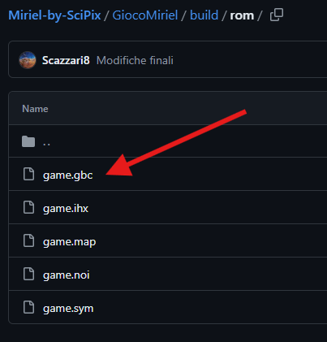

|  |
|:--:|

            
# Miriel-by-SciPix

---

Il seguente documento descrive i procedimenti per trovare la *rom* del videogioco ***Miriel*** (*link al trailer*: [Miriel by SciPix - YouTube](https://youtu.be/StA9qJh-EgI?si=cvelrEbvoVq2NVlY)) realizzato dai ragazzi della ***SciPix***, ovvero: Lorenzo Scazzari, Manuel Roberto Matera e Raffaele Nacci. 

                    

I passaggi da seguire per recuperare la *rom* sono i seguenti:

1. Aprire la cartella: "GiocoMiriel")
                                                

                                                   
2. Aprire la cartella: "build/rom"
                                                                        

                                                   
3. Aprire la cartella: "rom"
                                    

                                    
4. Selezionare la rom: "game.gbc"
                                    

                                    
5. Copiare il file "game.gbc" all'interno della cartella relativa alle rom dell'emulatore desiderato, quindi eseguire il core *GAMBATTE* per il GAMEBOY COLOR. 

Una volta seguiti tutti i passaggi puoi giocare alla  *demo* di ***Miriel***, BUON DIVERTIMENTO! 
